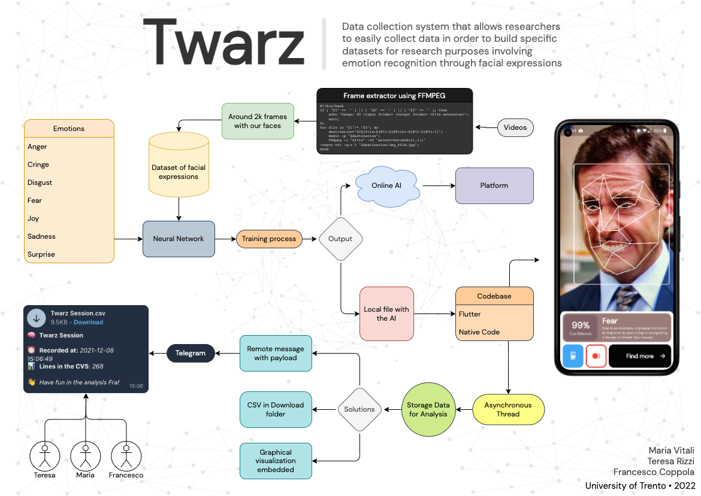

## 👋 Introduction
**Twarz** is a data collection system that allows researchers to easily collect data in order to
build specific datasets for research purposes involving emotion recognition through
facial expressions.

There already exists some emotional expressions datasets, which are often related to specific problems and contexts. However, the need for new datasets is constantly emphasized, in order to address **new issues and research questions**. 

Moreover, the ever-growing development of new technologies and tools opens many possibilities to faster and more precise techniques which aim to capture and analyze a wide range of
nonverbal behaviors and emotions.
## 🤖 Software stack

## ⚙️ Contributing

If you want to contribute to **Twarz**, feel free to open a pull request.

This project will use [GitHub issues](https://github.com/Azzeccagarbugli/twarz/issues) for tracking **requests and bugs**, so please *don't use* issues for general questions and discussion.

## 🗂 License

This project is licensed under the **LGPL v3.0 License** - see the [LICENSE](LICENSE) file for details.
